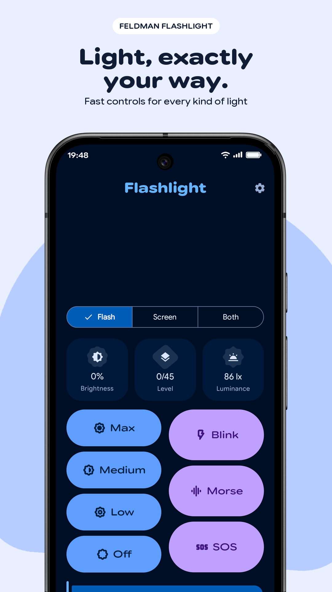
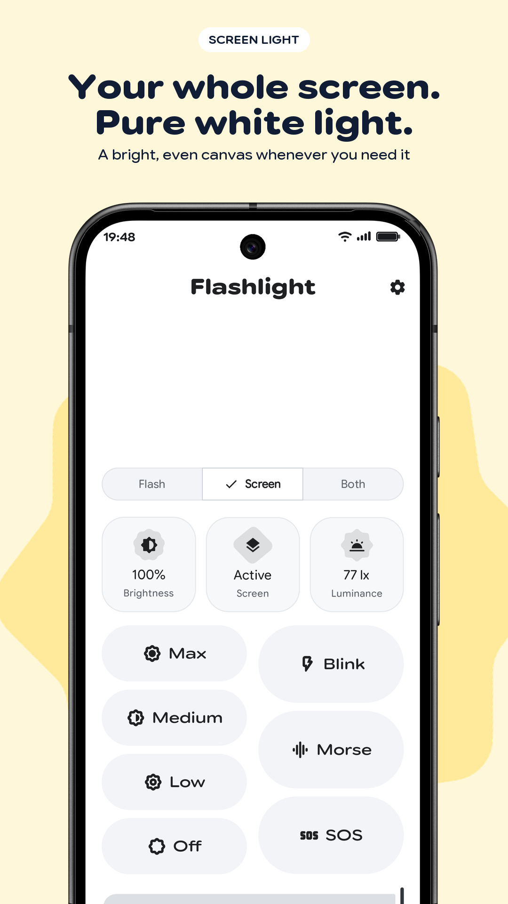
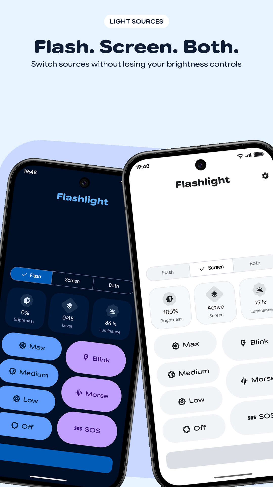
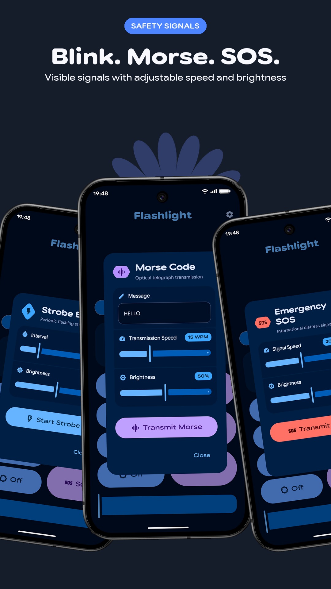
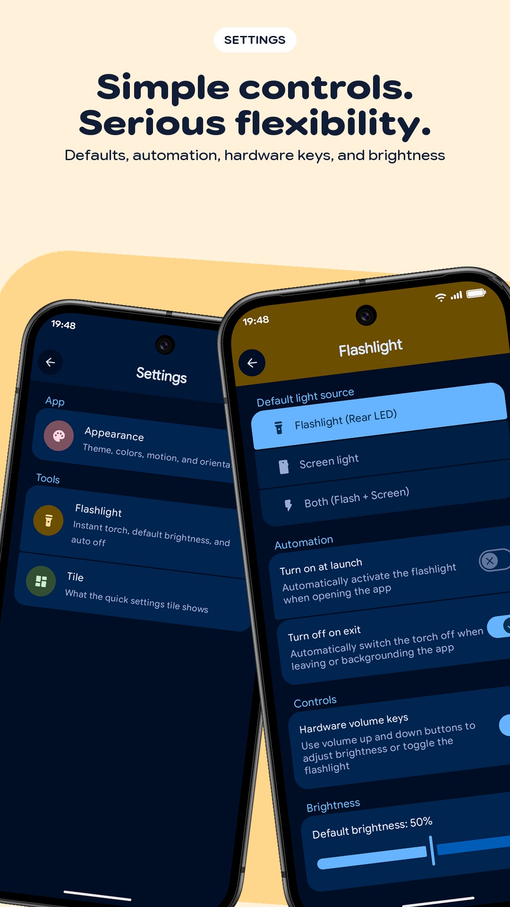
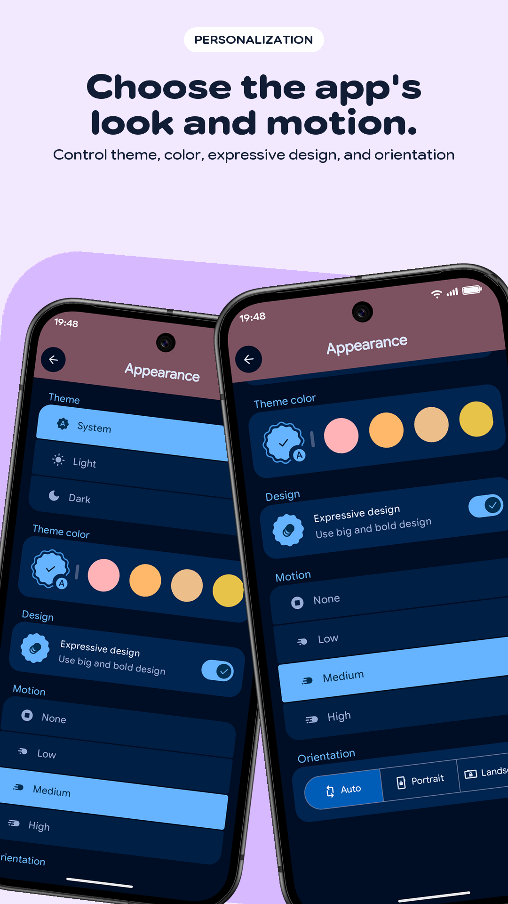
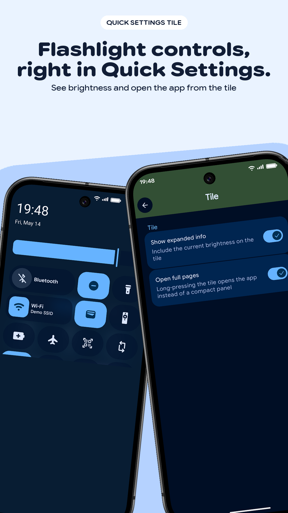
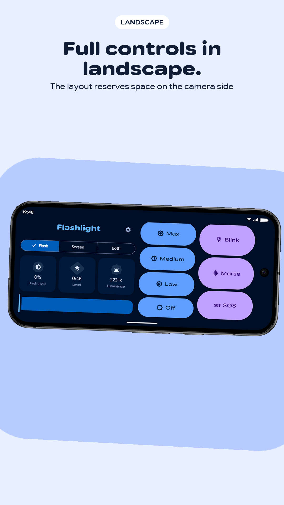
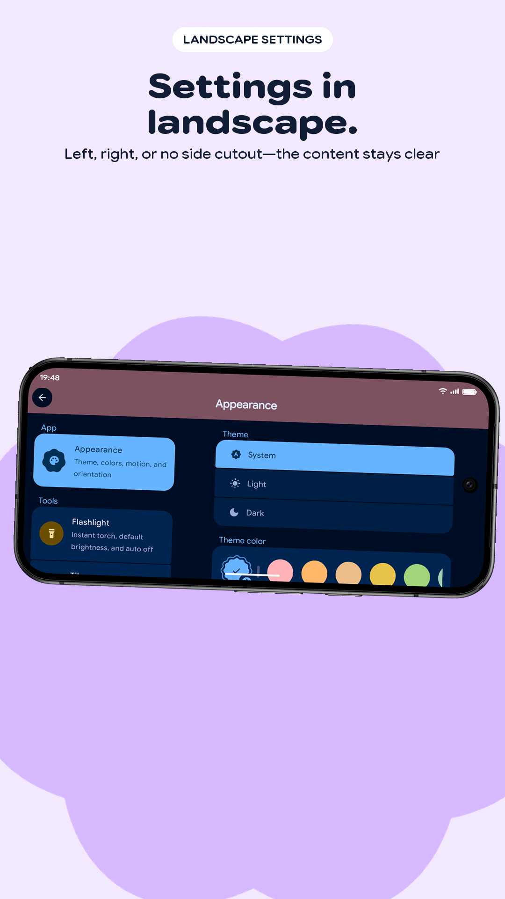

# Feldman Flashlight

A touch-first Android flashlight for the camera flash and the whole screen, with safety signals, a Quick Settings tile, expressive personalization, and cutout-safe landscape controls.

## Download

[**Download the latest APK from Releases**](https://github.com/feldmandev/feldman-flashlight/releases/latest)

> [!IMPORTANT]
> Android may ask you to allow installation from your browser or file manager. Only install APKs downloaded from this repository.

Feldman Flashlight requires Android 14 or newer.

## Features

- Control the camera flash at multiple intensity levels
- Turn the full display into an even screen light with preset or custom colors
- Run Blink, Morse, and SOS safety signals
- Use Flash, Screen, or Both light sources together
- See ambient luminance when the device provides a light sensor
- Control the flashlight from a configurable Quick Settings tile
- Configure automatic shutdown, volume-button controls, and launch behavior
- Personalize theme, colors, motion, expressive shapes, and orientation
- Use a dedicated landscape layout that accounts for left, right, or absent camera cutouts
- Keep settings entirely on-device without accounts, ads, analytics, or tracking

## Screenshots

### Phone

<p align="center">
  
  
  
</p>
<p align="center">
  
  
  
</p>
<p align="center">
  
  
  
</p>

## Source and builds

Requirements:

- JDK 17
- Android SDK 37

Build a debug APK:

```bash
./gradlew assembleDebug
```

Debug builds use Android's default debug key. To use your own signing key, copy [`keystore.properties.example`](keystore.properties.example) to `keystore.properties` and fill in the local values. Signing credentials and keystores are ignored by Git.

## Project policies

- [Privacy policy](https://feldmandev.github.io/feldman-flashlight/privacy-policy.html)
- [License page](https://feldmandev.github.io/feldman-flashlight/license.html)
- [Issue tracker](https://github.com/feldmandev/feldman-flashlight/issues)

## License

The source code is licensed under the [Apache License 2.0](https://feldmandev.github.io/feldman-flashlight/license.html). The canonical license text is also available in [`LICENSE`](LICENSE).

The Feldman name, logos, app icon, and promotional artwork are not licensed for reuse under the Apache License.
